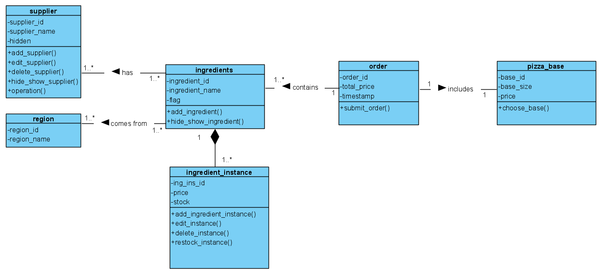
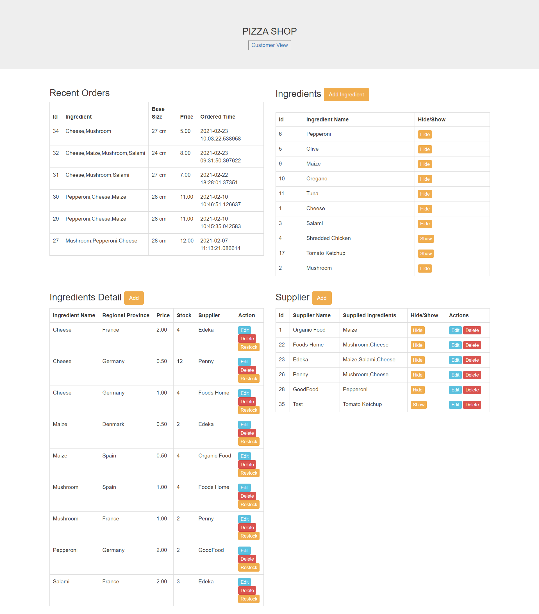
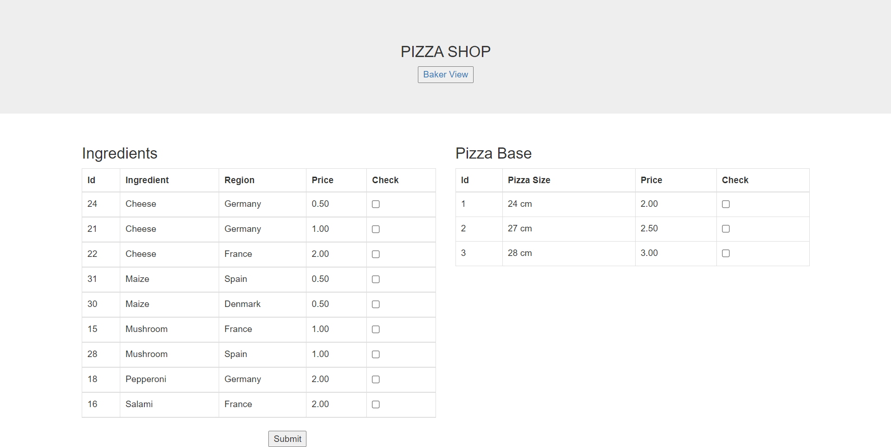

# Pizza-Ordering-System
A simple pizza ordering system using PHP and PostgreSQL

A part of univeristy project aims to implement all the logic in the database. The backend here is used only to process data from the database and pass it to the frontend. Through,
this project, one can get a better understanding of the PostgresSQL database and also enhances knowledge of PL/pgsql while implementing different logics.

UML Diagram

Baker View

Customer View

